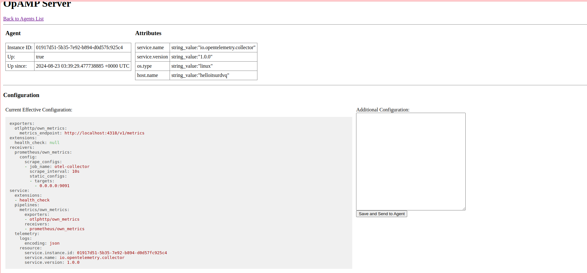

# OpAMP protocol implementation in Go

[Open Agent Management Protocol (OpAMP)](https://github.com/open-telemetry/opamp-spec)
is a network protocol for remote management of large fleets of data collection Agents.

OpAMP allows Agents to report their status to and receive configuration from a

Server and to receive agent package updates from the server.
The protocol is vendor-agnostic, so the Server can remotely monitor and manage a fleet of different Agents that implement OpAMP, including a fleet of
mixed agents from different vendors.

This repository is work-in-progress of an OpAMP implementation in Go.

## OpAMP
Observability vendors and cloud providers offer proprietary (độc quyền) solutions for agent management. In the open source observability space, there is an emerging standard that you can use for agent management: Open Agent Management Protocol (OpAMP).

The OpAMP specification defines how to manage a fleet of telemetry data agents. These agents can be OpenTelemetry collectors, Fluent Bit or other agents in any arbitrary combination.
OpAMP is a client/server protocol that supports communication over HTTP and over. 


## Setup
First, in the `./opamp-go/internal/examples/supervisor/supervisor.yaml` file, change the `$OTEL_COLLECTOR` with the actual file path. For example, if you installed the collector in `/usr/local/bin/` then you would replace `$OTEL_COLLECTOR` with /`usr/local/bin/otelcol`.

```yaml
server:
  endpoint: ws://127.0.0.1:4320/v1/opamp

agent:
  executable: $OTEL_COLLECTOR
```

After that, run the program: 
```shell
# run the backend server
cd 3_opamp-go/internal/examples/server
go run .
```

```shell
# launch the supervisor
cd 3_opamp-go/internal/examples/supervisor
go run .
```

The OpAmp server interface can be visited via [http://localhost:4321/](http://localhost:4321/), where user can see the collector listed and managed by the supervisor.

## Overview

This is an example of the log of an agent indicated that this agent is healthy:
```json
{"level":"info","ts":1724296433.6795378,"caller":"service@v0.107.0/service.go:116","msg":"Setting up own telemetry..."}
{"level":"info","ts":1724296433.6796288,"caller":"service@v0.107.0/telemetry.go:96","msg":"Serving metrics","address":":8888","metrics level":"Normal"}
{"level":"info","ts":1724296433.6804295,"caller":"service@v0.107.0/service.go:195","msg":"Starting otelcol...","Version":"0.107.0","NumCPU":12}
{"level":"info","ts":1724296433.680446,"caller":"extensions/extensions.go:36","msg":"Starting extensions..."}
{"level":"info","ts":1724296433.6804624,"caller":"extensions/extensions.go:39","msg":"Extension is starting...","kind":"extension","name":"health_check"}
{"level":"info","ts":1724296433.6804767,"caller":"healthcheckextension@v0.107.0/healthcheckextension.go:32","msg":"Starting health_check extension","kind":"extension","name":"health_check","config":{"Endpoint":"localhost:13133","TLSSetting":null,"CORS":null,"Auth":null,"MaxRequestBodySize":0,"IncludeMetadata":false,"ResponseHeaders":null,"CompressionAlgorithms":null,"ReadTimeout":0,"ReadHeaderTimeout":0,"WriteTimeout":0,"IdleTimeout":0,"Path":"/","ResponseBody":null,"CheckCollectorPipeline":{"Enabled":false,"Interval":"5m","ExporterFailureThreshold":5}}}
{"level":"info","ts":1724296433.6807256,"caller":"extensions/extensions.go:56","msg":"Extension started.","kind":"extension","name":"health_check"}
{"level":"info","ts":1724296433.6812036,"caller":"prometheusreceiver@v0.107.0/metrics_receiver.go:307","msg":"Starting discovery manager","kind":"receiver","name":"prometheus/own_metrics","data_type":"metrics"}
{"level":"info","ts":1724296433.6892905,"caller":"prometheusreceiver@v0.107.0/metrics_receiver.go:285","msg":"Scrape job added","kind":"receiver","name":"prometheus/own_metrics","data_type":"metrics","jobName":"otel-collector"}
{"level":"info","ts":1724296433.6893392,"caller":"healthcheck/handler.go:132","msg":"Health Check state change","kind":"extension","name":"health_check","status":"ready"}
{"level":"info","ts":1724296433.6893518,"caller":"service@v0.107.0/service.go:221","msg":"Everything is ready. Begin running and processing data."}
{"level":"info","ts":1724296433.6893597,"caller":"localhostgate/featuregate.go:63","msg":"The default endpoints for all servers in components have changed to use localhost instead of 0.0.0.0. Disable the feature gate to temporarily revert to the previous default.","feature gate ID":"component.UseLocalHostAsDefaultHost"}
{"level":"info","ts":1724296433.689391,"caller":"prometheusreceiver@v0.107.0/metrics_receiver.go:376","msg":"Starting scrape manager","kind":"receiver","name":"prometheus/own_metrics","data_type":"metrics"}
{"level":"info","ts":1724296466.4941783,"caller":"otelcol@v0.107.0/collector.go:318","msg":"Received signal from OS","signal":"interrupt"}
{"level":"info","ts":1724296466.4944324,"caller":"service@v0.107.0/service.go:258","msg":"Starting shutdown..."}
{"level":"info","ts":1724296466.494487,"caller":"healthcheck/handler.go:132","msg":"Health Check state change","kind":"extension","name":"health_check","status":"unavailable"}
{"level":"info","ts":1724296466.4959009,"caller":"extensions/extensions.go:63","msg":"Stopping extensions..."}
{"level":"info","ts":1724296466.4960709,"caller":"service@v0.107.0/service.go:272","msg":"Shutdown complete."}

```
The result when the program is set up properly:

