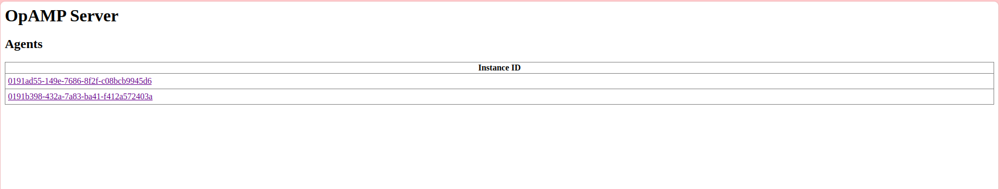

# Multiple agents management

In this section, some methods to run multiple agents in the project are provided with description. The OpAMP Supervisor for the OpenTelemetry Collector is designed to manage the configuration and status of one or more OpenTelemetry collector instances. Below, various approaches are detailed to manage multiple agents effectively.

### 1. Running separate supervisors
Multiple instances of the OpAMP Supervisor can be run each with a different configuration. Each supervisor can start and manage a separate Collector instance. Make sure that the OpAMP server is able to handle connections and scale appropriately. 

In this experiment, two different supervisors are used to manage `otelcol` and `otelcol-contrib` collector, respectively, running on the same server via [http://localhost:4321/](http://localhost:4321/). Each supervisor must be configured with a unique configuration file (e.g., supervisor.yaml) and a separate storage directory to avoid conflicts between the different instances. It manages a different Collector instance, which allows for version control and updating configuration without interference between the agents.

- Supervisor 1: Manages `otelcol` with configuration `supervisor_otelcol.yaml`.
- Supervisor 2: Manages `otelcol-contrib` with configuration `supervisor_otelcol_contrib.yaml`.

Scalability: If the project requires running more than two supervisors or Collectors, ensure the OpAMP server is appropriately scaled to handle the additional load. This may require more server resources (CPU, memory) or scaling to OpAMP server architecture.

### 2. Different hosts with virtual machine
In more complex setups, running each Collector on a separate virtual machine or physical host can provide full isolation and control. This method is ideal for environments where security and resource isolation are critical, such as multi-tenant environments.

* Virtual machines: Each VM hosts its instance of the OpenTelemetry Collector. Each virtual machine has its own supervisor managing the Collector.

* Physical Hosts: can run each Collector on separate physical servers.

* Networking: allows for Collectors to be deployed closer to their data sources (e.g., in edge environments) while still being managed.