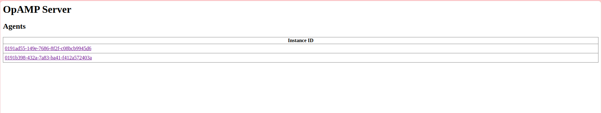

## Remote configuration
OpAMP allows Agents to report their status to and receive configuration from a server and to receive Agent installation package updates from the server. The protocol is vendor-agnostic, so the server can remotely monitor and manage a fleet of different Agents that implement OpAMP, including a fleet of mixed Agents from different vendors.

Remote configuration is an optional feature of the OpAMP protocol. It can be disabled if needed, such as when using an orchestration system like Kubernetes that handles configuration.

The server can provide a remote configuration to the Agent by setting the `remote_config` field in the `ServerToAgent` message. Since this message is usually sent in response to a status report, the Server can customize the configuration for the specific Agent based on its description.

If the Agent accepts remote configuration, the client must enable the `AcceptsRemoteConfig` bit in the `AgentToServer`.capabilities. If this bit is not set, the Server is not allowed to send a remote configuration to the Agent.

The actual configuration the Agent runs on, called the "Effective configuration," may differ from the remote configuration. The Agent typically merges the remote configuration with other inputs, like a local configuration, to form the Effective configuration.

Once the Effective configuration is established, the Agent uses it for operations, and the client will report this to the Server through the `effective_config` field in the status report. This allows the server, and potentially the end user, to view the Effective configuration along with other status data.

If the Agent can report its Effective configuration, the Client must set the `ReportsEffectiveConfig` bit in the AgentToServer.capabilities. If this bit is not set, the Server should not expect the `effective_config` field to be included in the `AgentToServer` message.

Here is the AgentToServer and ServerToAgent message, which is a binary serialized Protobuf message:
```protobuf
message AgentToServer {
    bytes instance_uid = 1;
    uint64 sequence_num = 2;
    AgentDescription agent_description = 3;
    uint64 capabilities = 4;
    ComponentHealth health = 5;
    EffectiveConfig effective_config = 6;
    RemoteConfigStatus remote_config_status = 7;
    PackageStatuses package_statuses = 8;
    AgentDisconnect agent_disconnect = 9;
    uint64 flags = 10;
    ConnectionSettingsRequest connection_settings_request = 11; 
    CustomCapabilities custom_capabilities = 12;
    CustomMessage custom_message = 13; 
}
```

```protobuf
message ServerToAgent {
    bytes instance_uid = 1;
    ServerErrorResponse error_response = 2;
    AgentRemoteConfig remote_config = 3;
    ConnectionSettingsOffers connection_settings = 4; 
    PackagesAvailable packages_available = 5; 
    uint64 flags = 6;
    uint64 capabilities = 7;
    AgentIdentification agent_identification = 8;
    ServerToAgentCommand command = 9; 
    CustomCapabilities custom_capabilities = 10; 
    CustomMessage custom_message = 11; 
}
```


## Status reporting
The client is required to send a status report when:

1. **Initial connection**: The client has to send the status report immediately upon establishing a connection with the Server. This must be the first message exchanged by the Client.

2. **Agent status changes**: A new status report must be sent each time there is a change in the Agent's status.

The status report is delivered via an `AgentToServer` message. Relevant fields within this message, such as `agent_description`, `capabilities`, `health`, `effective_config`, `remote_config_status`, and `package_status` should be set to reflect the current state of the Agent.

Once receiving the status report, the server must reply with a `ServerToAgent` message:
- If there is an error in processing the report, the `error_response` field must contain a `ServerErrorResponse` message.
- If processing is successful, the `error_response` field should remain unset and other fields can be updated as needed.

Keep in mind that the Agent's status might change after receiving a message from the server. For instance, if the server sends a remote configuration, the Agent’s status, such as its effective configuration, may be updated after processing the request. When this happens, the client should send an updated status report to the server. When the client receives a `ServerToAgent` message the client do not send a status report unless processing of the message received from the Server resulted in actual change of the Agent status (e.g. the configuration of the Agent has changed).

## Multiple agents management

In this section, some methods to run multiple agents in the project are provided with description. The OpAMP Supervisor for the OpenTelemetry Collector is designed to manage the configuration and status of one or more OpenTelemetry collector instances. Below, various approaches are detailed to manage multiple agents effectively.

### 1. Running separate supervisors
Multiple instances of the OpAMP Supervisor can be run each with a different configuration. Each supervisor can start and manage a separate Collector instance. Make sure that the OpAMP server is able to handle connections and scale appropriately. 

In this experiment, two different supervisors are used to manage `otelcol` and `otelcol-contrib` collector, respectively, running on the same server via [http://localhost:4321/](http://localhost:4321/). Each supervisor must be configured with a unique configuration file (e.g., supervisor.yaml) and a separate storage directory to avoid conflicts between the different instances. It manages a different Collector instance, which allows for version control and updating configuration without interference between the agents.



- Supervisor 1: Manages `otelcol` with configuration `supervisor_otelcol.yaml`.
- Supervisor 2: Manages `otelcol-contrib` with configuration `supervisor_otelcol_contrib.yaml`.

Scalability: If the project requires running more than two supervisors or Collectors, ensure the OpAMP server is appropriately scaled to handle the additional load. This may require more server resources (CPU, memory) or scaling to OpAMP server architecture.

### 2. Different hosts with virtual machine
In more complex setups, running each Collector on a separate virtual machine or physical host can provide full isolation and control. This method is ideal for environments where security and resource isolation are critical, such as multi-tenant environments.

* Virtual machines: Each VM hosts its instance of the OpenTelemetry Collector. Each virtual machine has its own supervisor managing the Collector.

* Physical Hosts: can run each Collector on separate physical servers.

* Networking: allows for Collectors to be deployed closer to their data sources (e.g., in edge environments) while still being managed.